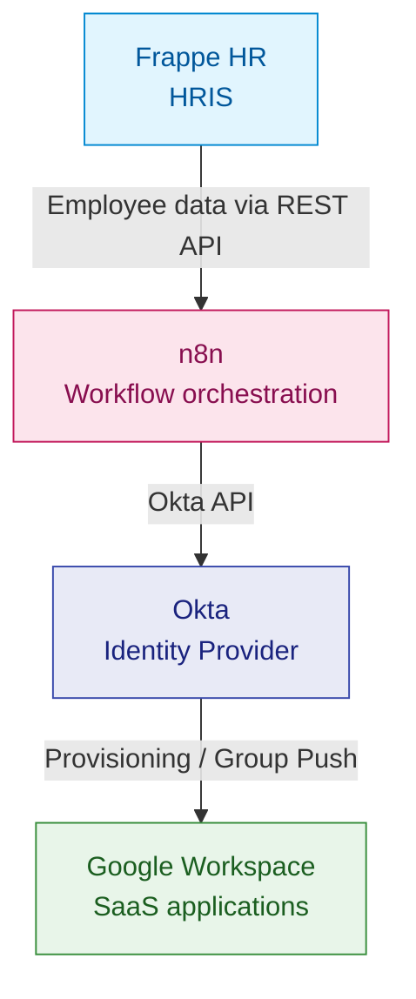

# SaaS Lifecycle Automation Lab

A hands-on Systems Engineering project demonstrating how to automate employee identity and SaaS access lifecycle management using HR-driven workflows.

## Overview

This project simulates an enterprise IT environment where employee lifecycle events originate in an HR system and drive identity management and SaaS provisioning.

The lab integrates Frappe HR, n8n, Okta, and Google Workspace to explore how IT teams can automate employee onboarding, identity updates, and access management while maintaining consistent identity data across systems.

The project is designed to demonstrate practical skills in:

- Identity and Access Management (IAM)
- Joiner-Mover-Leaver (JML) lifecycle automation
- HRIS-to-identity-provider integration
- Workflow orchestration and API integration
- Infrastructure as Code (IaC)
- SaaS administration and access governance

## Architecture

The lab follows an HR-driven identity lifecycle architecture:

## Implemented Features

### HRIS-to-Okta Synchronization

- Retrieve employee records from Frappe HR using its REST API.
- Orchestrate HR data processing with n8n.
- Compare HRIS employee records with existing Okta users.
- Use the Frappe HR Employee ID as the identity matching attribute in Okta (`employeeNumber`).
- Create Okta user accounts for eligible employees.

### Identity Lifecycle Management

- Explore Joiner-Mover-Leaver (JML) lifecycle automation.
- Classify employee records based on HR and Okta data.
- Support user activation and profile updates through Okta workflows.

### Infrastructure and SaaS Administration

- Run the lab components locally using Docker Compose.
- Manage selected Cloudflare DNS resources with Terraform.
- Automate Google Workspace user creation using GAM7.

## Implementation Status

| Area | Status |
|---|---|
| Frappe HR REST API integration with n8n | Implemented |
| HRIS-to-Okta user comparison | Implemented |
| Okta user creation | Implemented |
| Okta Workflows for identity lifecycle operations | In progress |
| Google Workspace provisioning and group automation | In progress |
| Terraform infrastructure automation | Partially implemented |

## Testing and Validation

The lab is being developed incrementally, with a focus on validating identity lifecycle behavior across HRIS and identity systems.

Current work includes testing employee data retrieval, identity matching, and Okta account operations.

Further validation is planned for complete Joiner-Mover-Leaver scenarios, rehire handling, and downstream SaaS provisioning.

## Prerequisites

The following tools and accounts are used to build and operate the lab:

- Docker Desktop and Docker Compose
- Git and GitHub
- n8n
- Frappe HR
- Okta Integrator Free Plan
- Google Workspace
- GAM7 (Google Apps Manager)
- Terraform
- A Cloudflare account for DNS automation

Some integrations require API credentials and service account configuration. Keep credentials in local environment variables or secret-management systems and never commit them to Git.